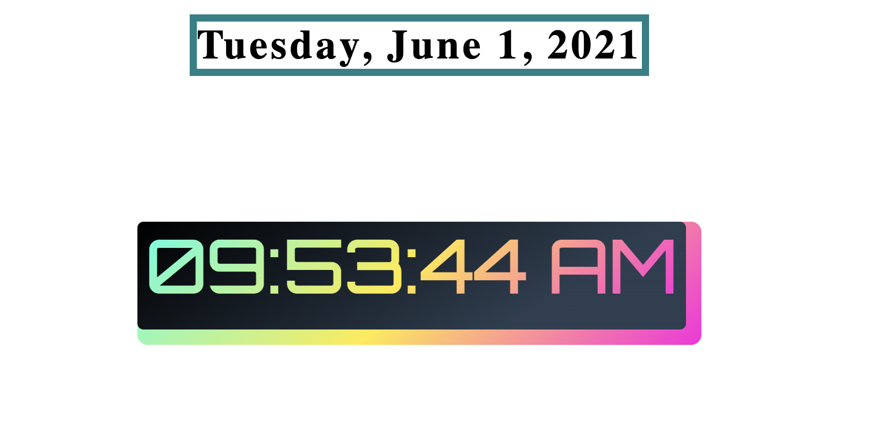

# Digital Clock App

### A smal project to exercise the basics concepts of the DOM envents.

---

###### setTimeInterval(); Date(); Arrays; innerHTML

---

- HTTM
- CSS
- JavaScript

  
  ### Link https://jairneto1.github.io/Digital-Clock/
